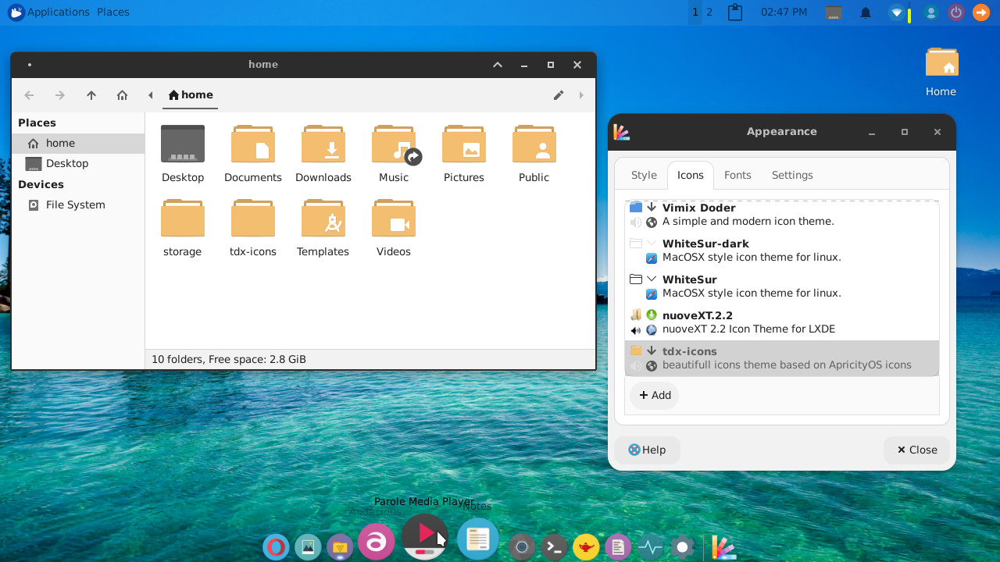

# tdx-icons
Modern icons for termux-desktop-xfce based on ApricityOS icons

tdx-icons are the OFFICIAL icons of the new update of termux-desktop-xfce



## Installation 

```bash
git clone --depth 1 https://github.com/Yisus7u7/tdx-icons
cd tdx-icons
./install.sh $PREFIX/share/icons
cd .. && rm -rf tdx-icons
```

you can change the $ PREFIX / share / icons path to another if you want, example:
$HOME/.icons

More information in :

https://yisus7u7.github.io/termux-desktop-xfce/big_update/
